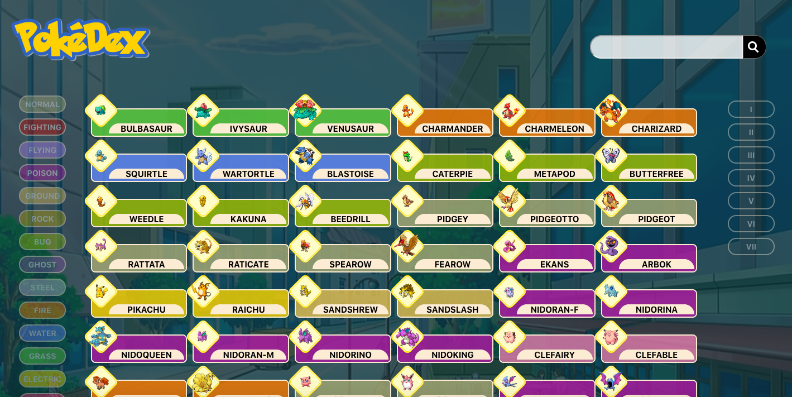
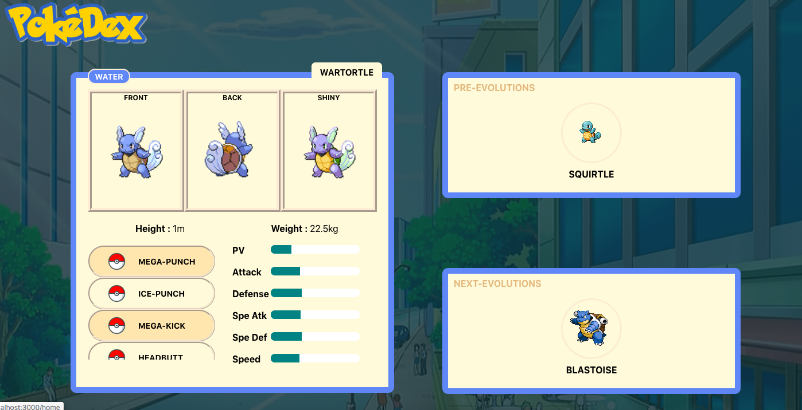

## Project overview

This app is about Pokemon. Created in a M1 exam context, this React-made app offers several filter features listed below.

## How to make it work

Runs the app in the development mode by the following command in the main directory : `npm start` . 
Open [http://localhost:3000](http://localhost:3000) to view it in the browser.

## Features

### Home Page

`Filter pokemon by types` : On the left side of the homepage, a list of all Pokemon types is displayed.
When clicking on a type badge, the list of all pokemon from all generations matching this type will be displayed.

`Filter pokemon by generations` : On the right side of the homepage, a list of all Pokemon Generations is displayed.
When clicking on a generation badge, the list of all pokemon from this generations will be displayed.

`Search a specific pokemon` : Above the main-container, there's a search bind with the pokemon container.
Typing something in this input will automatically filter Pokemon who contains your search in their name.
Pressing Enter will redirect to the same page with a Query parameter `search` set.

`Access to a pokemon's specific data` : Clicking on a Pokemon card will redirect to `/pokeinfo/{pokemonName}` 

### Pokemon page

`Read the pokemon's data` : The card on the left displays several data about the Pokemon you clicked.
Three pictures of the pokemon's apperance in the game are in the card's header.
Below, the average height and weight of the Pokemon are shown. 
There's also a vertical scrolling container which lists all the possible moves for this pokemon.
Facing that, a set of stat bars shows the power of this pokemon relative to the average values.

`Navigate through the Pokemon's chain evolution` : In front of the card, two boxes are displayed.
Inside the first box, you'll find the pre-evolutions of the pokemon you chose.
inside the second box, you'll find the future-evolutions of the pokemon you chose.
Clicking on one of those pre/future-evolutions will redirect you this Pokemon's data.

This project was bootstrapped with [Create React App](https://github.com/facebook/create-react-app).
